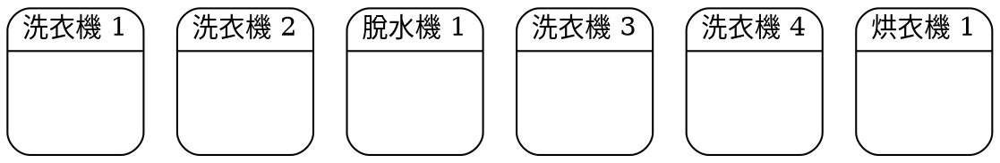

# 洗衣機小天使 - 0912

###### tags: `SideProject`

## 簡介

~~因為我排不到洗衣機 幹~~

運用群眾大數據，解決洗衣機排隊問題。

這是一個 line bot，讓你可以協助登錄洗衣機的使用狀態以節省自己與他人的排隊等候時間。

## 使用教學

晚點再告訴你

## 功能

### 初始化：登記舍別＆樓層

開發進度：還沒做

使用者加入時，可以設定自己的舍別及樓層，以利未來接收訂閱通知。

註：第一階段只開放二舍九樓使用。

### 登錄：使用中

開發進度：還沒做

使用者可以手動登錄機器狀態為「使用中」。

註：機器分為洗衣機、脫水機、烘衣機，同型機器最左邊為一號。

示意圖：

### 登錄：閒置

開發進度：還沒做

使用者可以手動登錄機器狀態為「閒置」。

### 訂閱洗衣機

開發進度：還沒做

訂閱洗衣機狀態，你的樓層有洗衣機閒置時會通知你。

註：未來樓層範圍可能會改成上下一樓及／或上下二樓（可選）。

### 即時狀態查閱

開發進度：還沒做

看現在洗衣機有沒有人在用。

## Developers

- CA-Lee